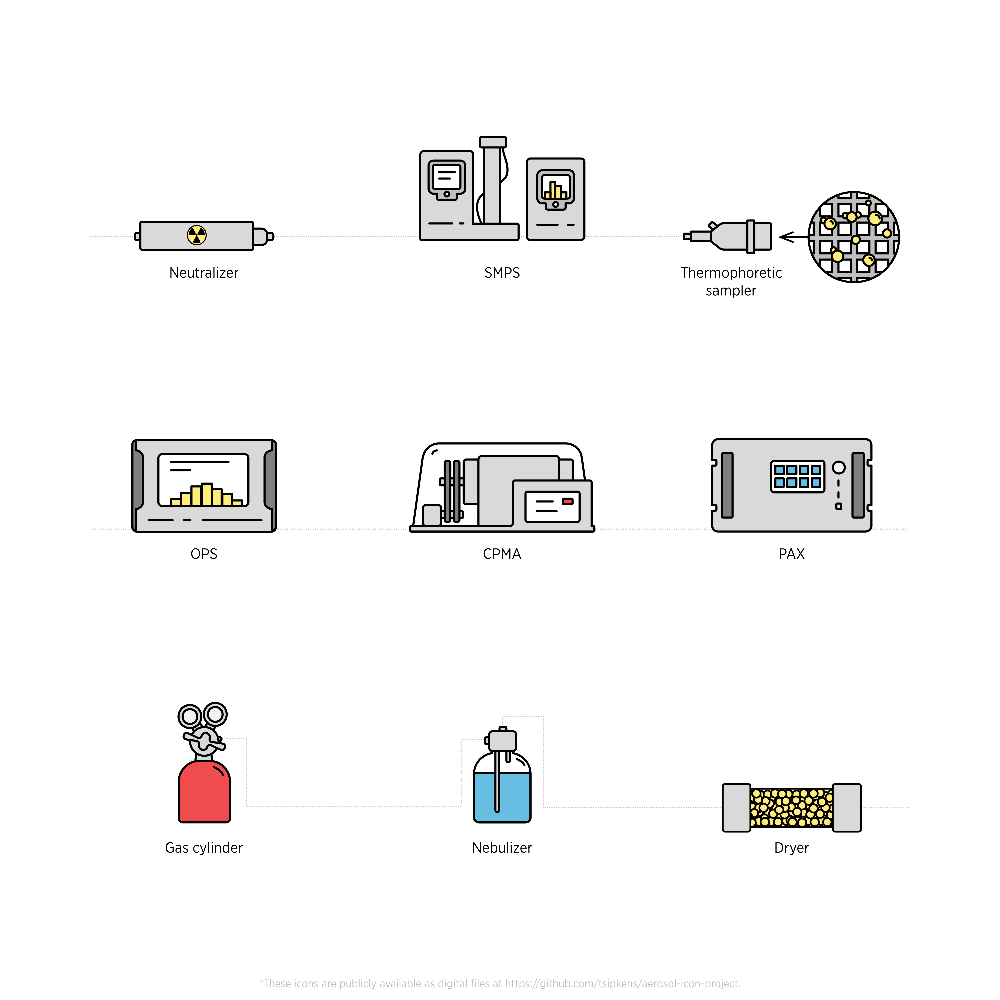
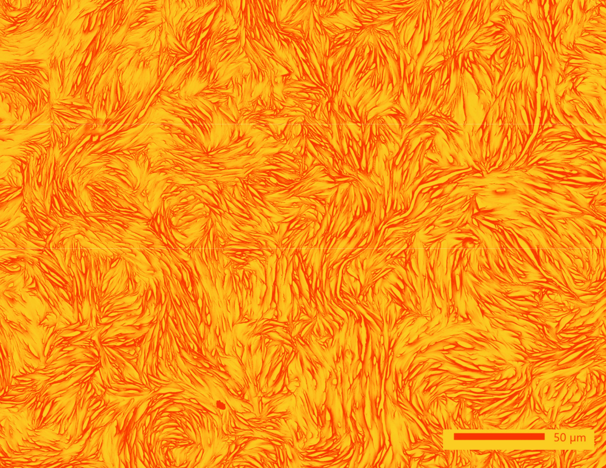
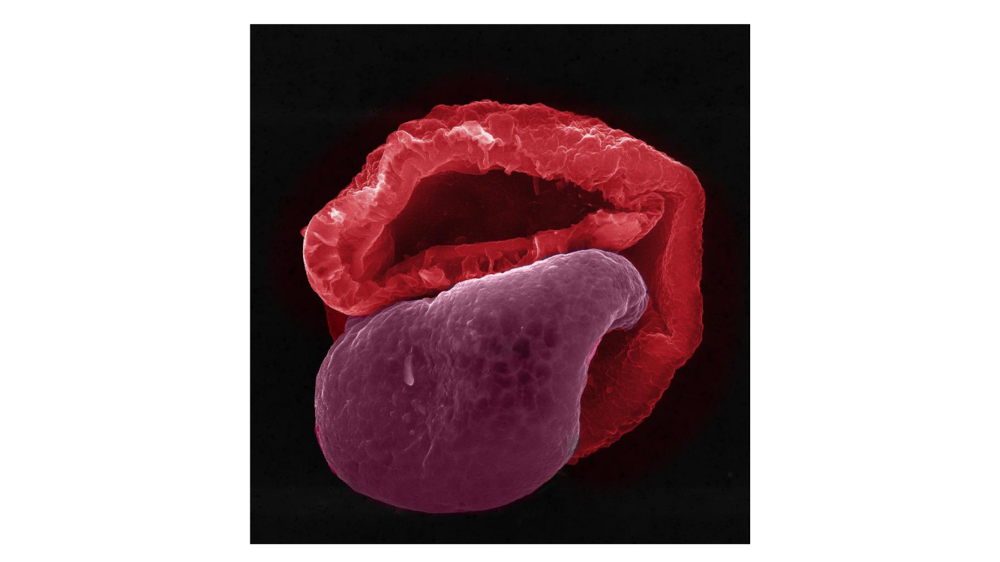

```{r setup, include=FALSE}
knitr::opts_chunk$set(echo = TRUE)
library(vembedr)
```

Below are the finalists for the 2022 AAAR Aerosol Fine Art Competition: Non-Microscopic (Larger) Scale. Please vote by casting your paper ballots (included in your AAAR registration package) at the membership booth! You can vote for your favorite entry in three categories:

1. Video
2. Microscopic Scale
3. Non-Microscopic (Larger) Scale

Entries for the Microscopic Scale as well as the Videos can be viewed via the navigation bar at the top of the page.

---

## Entry ID #9: The Deposition Pattern of Nebulized Fluorescent Droplets in an Idealized Mouth throat Airway
_Yueyang Cai (Nanjing Normal University); Huizhen Yang (Nanjing Normal University); Xiaole Chen (Nanjing Normal University); and Ting Ding (Nanjing Normal University)_

>We achieved the visualization of the deposition pattern of nebulized droplets in an idealized mouth-throat (MT) airway model using normal saline with fluorescence. The fluorescent droplets were generated by a vibrating mesh nebulizer install at the inlet of the MT airway model. Air and the droplets were drawn into the MT airway model by a vacuum pump at a flow rate of 60 L/min. After the test, the two-piece symmetrical model was dissembled. The figure recorded one piece of the MT model exposed under the UV light. Most droplets deposited on the rear side of the oropharynx region, i.e., the right side of the curved pipe shown in the figure, due to the inertial impact. There are also deposition occurred at the bottom of the mouth cavity, which is caused by the gravitational sedimentation of the nebulized droplets.


---

## Entry ID #10: Aerosol Icon Project
_Timothy Sipkens (National Research Council Canada)_

>An open-source project to develop a set of icons for a range of common aerosol-related devices.



---

## Entry ID #16: Me and My Dog
_Shalinee Kavadiya (University of Miami), Yiming Xi (University of Miami), Pratim Biswas (University of Miami)_

>Crumpled graphene oxide synthesized in furnace aerosol reactor.


---

## Entry ID #19: Convoluted Beauty
_Shalinee Kavadiya (University of Miami); Sujit Modi (Washington University in Saint Louis); and Pratim Biswas (University of Miami)_

>Morphology of polyethylene glycol printed with a novel aerosol-based 3D printer technology.



---

## Entry ID #21: Can You Guess My Name?
_Traci Lersch (RJ Lee Group)_

>This pollen with an attitude collected from the ambient air of California symbolizes one of greatest rock 'n' roll bands in the world!

