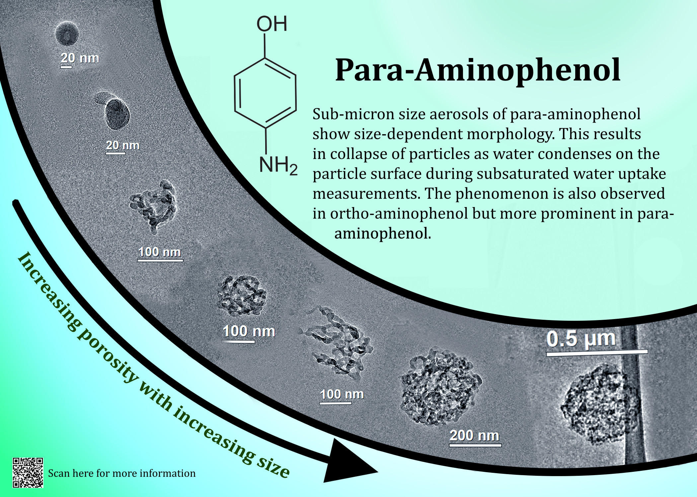
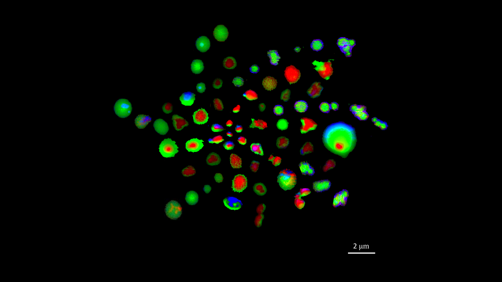
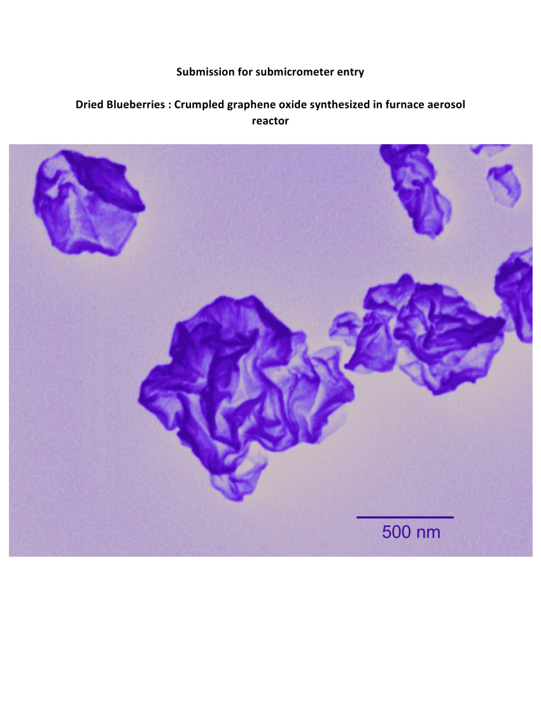
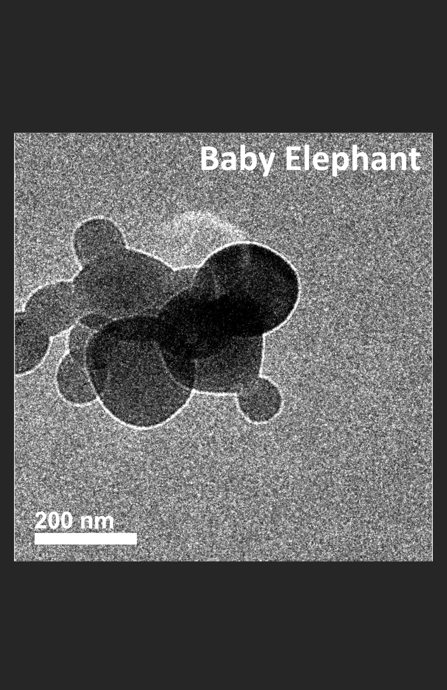

```{r setup, include=FALSE}
knitr::opts_chunk$set(echo = TRUE)
library(vembedr)
```

Below are the finalists for the 2022 AAAR Aerosol Fine Art Competition: Microscopic Scale. Please vote by casting your paper ballots (included in your AAAR registration package) at the membership booth! You can vote for your favorite entry in two categories:

1. Microscopic Scale
2. Non-Microscopic (Larger) Scale

Entries for the Non-Microscopic (Larger) Scale as well as the videos can be viewed via the navigation bar at the top of the page.

---

## Entry ID #8: Size Dependent Morphology of Para-Aminophenol
_Dewansh Rastogi (University of Maryland College Park), Kotiba Malek (University of Maryland College Park)_

>Morphology of para-aminophenol is observed to vary drastically with size as one moves from particle sizes of 20 nm to 500nm



---

## Entry ID #13: Microscopy Images from Cured-in-Place-Pipe Installation Particles
_Brianna Peterson (Purdue University), Ana Morales (Purdue University), Jay Tomlin (Purdue University)_

>Scanning transmission x-ray microscopy images of resin, composite, and emission particles found in cured-in-place-pipe installations, a common method used to repair sewer systems. Green represents organic carbon, red represents sp2 hybridized carbon, and blue represents inorganic material.



---

## Entry ID #15: Dried Blueberries
_Shalinee Kavadiya (University of Miami), Yiming Xi (University of Miami), Pratim Biswas (University of Miami)_

>Crumpled graphene oxide synthesized in furnace aerosol reactor.



---

## Entry ID #18: Baby Elephant in Shades of Gray
_Emma Tackman (The Pennsylvania State University)_

>Ammonium sulfate nanoparticle cluster in the shape of a baby elephant.

